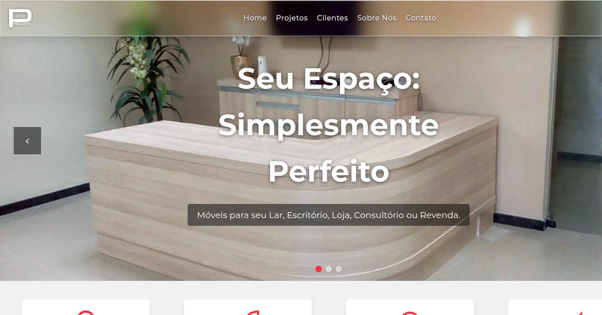

# 🚀 Projett Móveis - Website Institucional



## ✨ Destaques

- **Design Moderno** com efeitos de vidro e transições suaves
- **Performance Otimizada** (Carregamento em <3s)
- **100% Responsivo** para todos os dispositivos
- **Portfólio Interativo** com vídeos 360°
- **Conformidade LGPD** com documentos legais integrados

## 🛠 Stack Tecnológica

| Camada       | Tecnologias                                         |
| ------------ | --------------------------------------------------- |
| **Frontend** | HTML5, CSS3 (Grid/Flexbox), JavaScript (ES6+)       |
| **Design**   | Efeito Glass Morphism, Animações CSS, Variáveis CSS |
| **Plugins**  | Lottie Web, Intersection Observer API               |
| **SEO**      | Schema.org, Open Graph, Meta Tags otimizadas        |

## 🎨 Paleta de Cores

```css
:root {
  --primary: #2c3e50;
  --accent: #e74c3c;
  --light: #ecf0f1;
  --dark: #1a252f;
}
```

## 🚀 Experimente ao vivo!

[](https://leonardosabino2025.github.io/projettmoveis/)

**Link direto:**  
🔗 [leonardosabino2025.github.io/projettmoveis](https://leonardosabino2025.github.io/projettmoveis/)

### 📂 Estrutura do Projeto

```
📦 PROJETT MÓVEIS
├── 📁 assets
│ ├── 📁 css
│ ├── 📁 imgs
│ ├── 📁 js
│ └── 📁 videos
├── 📁 midia
├── 📄 about-us-section.html
├── 📄 index.html
├── 📜 LICENSE
├── 📄 privacy-policy.html
├── 📘 README.md
├── 🎨 style.css
└── 📄 terms-of-use.html
```

### 🌈 Recursos Exclusivos

## 🧊 Navbar Dinâmica

## Efeito "Liquid Glass"

Muda estilo conforme scroll

Adaptação para mobile

## 🎥 Carrossel Hero

## 20 projetos em destaque

## Navegação por thumbnails

## Transições suaves

## 📱 WhatsApp Smart

### Botão flutuante animado

## Aparece somente após hero section

## Desaparece próximo ao footer

```
📊 SEO & Acessibilidade
✅ Schema Markup para negócio local
✅ Meta tags para redes sociais
✅ Navegação por teclado
✅ Contraste WCAG AA
✅ Imagens com alt text
```

### 📜 Licença

## MIT License - Ver detalhes

Desenvolvido por Leonardo Sabino

[](https://www.linkedin.com/in/leonardo-sabino/)

[](https://wa.me/5584921483009)

[](https://www.instagram.com/leonardocsabino/)

<!--
Alt text: Instagram badge featuring the Instagram logo in white on a pink and orange background, displaying the word Instagram in bold white text. The badge has a friendly and inviting tone, designed to encourage visitors to connect on social media.
-->

💡 "Criando espaços que inspiram" - Projett Móveis
